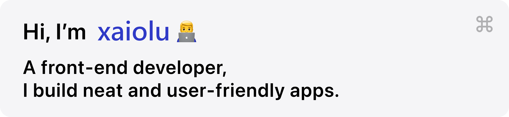

# 
Hi 👋, I'm Karlbaey

## 📋个人简介

**✍一个喜欢写写小作品的人**
按我跳转 --> [我的主页](//xaiolu.top)
按我跳转 --> [小路文章博客](//xn--yetq47i.top)
按我跳转 --> [测试hugo博客](//xaiolu.github.io/hugo-stack)
按我跳转 --> [我的导航](//ys.xaiolu.top)

通常以 [@xaiolu](//github.com/xaiolu) 的身份活跃在 [GitHub](//github.com)，也喜欢在哔哩哔哩以 [@xaiolu](https://space.bilibili.com/436231597) 的身份活跃，有时你也能在各大社交平台看见我，甚至有可能是 百度 服务器。

下面列出了我常用的编程语言和平台：

     

### 📕**最近在读**

1*天渊*

### ☕在忙的事

- 更新[个人博客](//xn--yetq47i.top)
- 摆弄 php 和 python
- 学习 HTML、CSS 和 JavaScript 三兄弟

## 🥇个人项目

~~是的，现在只有这个 Repo 拿得出手。~~

## 🛎️个人服务

以下内容纯粹出于兴趣，不保证稳定性。

|       标识符       |           URL           |
| :----------------: | :---------------------: |
|   小盆友首页        |      xaiolu.top         |
|  小盆友导航页       |       ys.xaiolu.top     |
|    小路文章         |     xn--yetq47i.top     |
|      *待补充*       |            -            |

## ⏫栈

### 🧑‍🤝‍🧑自然语言

- 中文（zh-hans、zh-hant）
- English（en-US）

### ⌨️编程语言

- [ ] C / C# / C++
- [ ] Java
- [x] Python
- [x] HTML
- [x] CSS
- [ ] JavaScript / TypeScript

#### 📌以及其他的……

- [x] Markdown
- [x] KaTeX

### 🖥️操作系统

- Windows 11
- Android

~~是的我就是那么的钉子户~~

### 🥰其他偏好

- 搜索引擎：[Bing](//bing.com)、[Google](//google.com)
- 文本编辑：
	- Markdown：[Typora](//typoraio.cn)
	- Python 和其他：[Visual Studio Code](//code.visualstudio.com/)
- 下载：Internet Download Manager

## 🔗联系我

以下两种联系方式都很欢迎！或者你也可以发送至这个邮箱：<a href="mailto:xaiolu.top@gmail.com">xaiolu.top@gmail.com</a>

 

## Hey 👋, This is xaiolu

 
## Some of my Github Stats

  

  &nbsp;
  

### My Works

  
  &nbsp;&nbsp;&nbsp;

  
  &nbsp;&nbsp;&nbsp;
   
  &nbsp;&nbsp;&nbsp;
  

————————————————
  &nbsp;&nbsp;&nbsp;

                          
